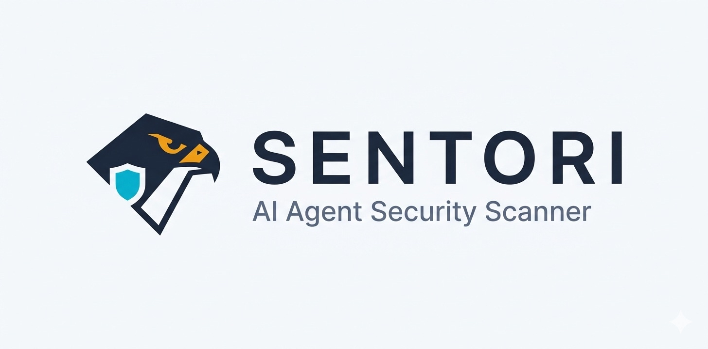

<p align="center">
  <picture>
    <source media="(prefers-color-scheme: dark)" srcset="./assets/banner-dark.png">
    <source media="(prefers-color-scheme: light)" srcset="./assets/banner-light.png">
    
  </picture>
</p>

<p align="center">
  <strong>守るべきものを、守る。</strong>
</p>

[](https://www.npmjs.com/package/@nexylore/sentori)
[](./LICENSE)
[](https://github.com/TakumaLee/Sentori/actions)

**Sentori** is a security scanner purpose-built for the MCP (Model Context Protocol) ecosystem and AI agent toolchains. Where broad surface-area tools scan everything loosely, Sentori goes deep — covering prompt injection, supply chain poisoning, MCP misconfigs, secret leaks, and agentic attack vectors that generic scanners miss entirely.

*Depth over breadth. MCP-native from day one.*

---

## 🚀 Quick Start

```bash
# Scan current directory
npx @nexylore/sentori scan

# Scan a specific agent project
npx @nexylore/sentori scan ./path/to/agent

# JSON output for CI/CD pipelines
npx @nexylore/sentori scan ./path/to/agent --json

# Save report to file
npx @nexylore/sentori scan ./path/to/agent --output report.json

# Enable deep scan (OCR on images)
npx @nexylore/sentori scan ./path/to/agent --deep-scan
```

---

## Why Sentori?

AI agents in 2026 operate with real tool access: file systems, APIs, databases, code execution. A single compromised MCP server or skill package can escalate to full system access — no exploit chain required.

**Generic SAST tools don't understand agent attack surfaces.** They won't catch:
- Prompt injection embedded in MCP tool descriptions
- Convention squatting attacks on skill registries
- Covert DNS/ICMP exfiltration channels in agent tools
- Visual prompt injection hidden in image metadata
- RAG poisoning via repetition attacks in knowledge bases

Sentori was built specifically for these agentic threat vectors.

---

## 🔍 29 Security Scanners

Sentori ships with **29 scanners** across 7 categories:

### 🔗 Supply Chain & Code Integrity

| Scanner | What it catches |
|---------|----------------|
| **Supply Chain Scanner** | Base64 hidden commands, RCE patterns, IOC blocklist, credential theft, data exfiltration, persistence mechanisms |
| **Postinstall Scanner** | Malicious `postinstall` scripts that execute on package installation |
| **LangChain Serialization Scanner** | Unsafe pickle/deserialization in LangChain and agent pipelines |
| **Convention Squatting Scanner** | Typosquatting, prefix hijacking, namespace confusion on skill and MCP server names |
| **NPM Attestation Scanner** | Verifies npm package attestations and OIDC provenance signatures for supply chain integrity |
| **IDE Rule Injection Scanner** | Malicious `.cursorrules`, `.windsurfrules`, `.github/copilot-instructions.md` that inject prompts into developer IDEs |

### 💉 Prompt Injection & Adversarial

| Scanner | What it catches |
|---------|----------------|
| **Prompt Injection Tester** | Known injection patterns in prompts, MCP tool descriptions, and user-facing text |
| **Visual Prompt Injection Scanner** | Hidden instructions embedded in images (alt text, metadata, steganography) |
| **RAG Poisoning Scanner** | Repetition attacks and content poisoning in RAG knowledge bases |
| **Red Team Simulator** | Simulates jailbreaks, role-play exploits, multi-turn attacks, and indirect injection vectors |

### 🔐 Secrets & Data Protection

| Scanner | What it catches |
|---------|----------------|
| **Secret Leak Scanner** | API keys, tokens, passwords, private keys across code and configs |
| **Clipboard Exfiltration Scanner** | Clipboard access patterns used for silent data theft |
| **DNS/ICMP Tool Scanner** | Covert data exfiltration via DNS tunneling or ICMP channels in agent tools |

### 🛡️ Configuration & Permissions

| Scanner | What it catches |
|---------|----------------|
| **DXT Security Scanner** | Insecure Claude Desktop Extensions — unsandboxed execution, unrestricted file/network access |
| **MCP Config Auditor** | Dangerous MCP server configurations, overprivileged tools, missing authentication |
| **Agent Config Auditor** | Risky agent configurations, missing safety guardrails and rate limits |
| **Hygiene Auditor** | Overly broad permissions, missing access controls, risky defaults |
| **Permission Analyzer** | Excessive permission grants, missing least-privilege enforcement |
| **Environment Isolation Auditor** | Missing sandboxing, shared environments, container escape risks |
| **Tetora Config Auditor** | Tetora agent configuration security — unsafe dispatch settings, missing guardrails, overprivileged roles |

### 🧪 Architecture & Defense

| Scanner | What it catches |
|---------|----------------|
| **Skill Auditor** | Skill package structure issues, unsafe patterns, missing validation |
| **Channel Surface Auditor** | Multi-channel attack surfaces, unprotected input channels |
| **Defense Analyzer** | Missing defense layers, gaps in security architecture |

### 🔮 MCP Specialist Suite

| Scanner | What it catches |
|---------|----------------|
| **MCP Tool Shadowing Detector** | Tool names that mimic legitimate MCP server tools to intercept calls — lookalike names (Levenshtein distance), separator swaps (`read-file` vs `read_file`), and case differences (`Bash` vs `bash`) |
| **MCP Git CVE Scanner** | Checks MCP server dependencies against known CVE databases |
| **MCP Tool Manifest Scanner** | Validates MCP tool manifests for schema issues, missing fields, and unsafe defaults |
| **MCP Tool Result Injection Scanner** | Detects injection vectors in MCP tool result handling — malicious payloads returned from tools to the LLM |

### 🤖 Agent Framework Security

| Scanner | What it catches |
|---------|----------------|
| **Agentic Framework Scanner** | Security issues across multi-agent frameworks — unsafe delegation, missing guardrails, unvalidated tool outputs |
| **A2A Security Scanner** | Google A2A (Agent-to-Agent) protocol vulnerabilities — unauthenticated endpoints, missing capability restrictions, insecure task delegation |

### Coming Soon

- **Agentic Loop Detector** — identifies infinite loop / resource exhaustion risks in multi-step agent plans

---

## 📊 Security Scoring

Sentori outputs a **Security Grade** (A+ to F) based on confidence-weighted findings across 4 dimensions:

```
╔══════════════════════════════════════════╗
║         Sentori Security Report          ║
╠══════════════════════════════════════════╣
║  Security Grade:  B+    (78/100)         ║
║  Findings:  2 high · 5 medium · 3 low   ║
║  Scanners:  29/29 active                 ║
╚══════════════════════════════════════════╝
```

### 3-Dimension Scoring

| Dimension | Weight | What it measures |
|-----------|--------|-----------------|
| Code Safety | 35% | Supply chain, secrets, injection patterns in code |
| Config Safety | 25% | MCP configs, DXT manifests, permissions, channels |
| Defense Score | 25% | Presence of guardrails, sandboxing, prompt hardening |
| Env Safety | 15% | Isolation, shared environment risks, container config |

**Floor rule:** If any single dimension scores F (<60), the overall score is capped at that dimension's score + 10. Security is only as strong as the weakest link.

### Confidence Levels

Each finding carries a **confidence** level that affects its weight in the score:

| Confidence | Weight | When assigned |
|------------|--------|---------------|
| `definite` | 1.0× | Direct pattern match (e.g., hardcoded API key) |
| `likely` | 0.8× | Static analysis with low false positive rate |
| `possible` | 0.6× | Inferential analysis (e.g., missing defense detection) |

Third-party code findings are further weighted at 0.3× (developers can't directly fix vendored code).

### CLI Flags

| Flag | Description |
|------|-------------|
| `--include-vendored` | Include third-party/vendored directories in the scan |
| `--json` | Output results as JSON |
| `--output <file>` | Save JSON report to file |
| `--context <app\|framework\|skill>` | Set scan context for severity adjustments |

### JSON Output

When using `--json` or `--output`, the report includes:

- `summary.dimensions` — per-dimension scores (`codeSafety`, `configSafety`, `defenseScore`, `environmentSafety`)
- `summary.scannerBreakdown` — per-scanner finding counts by severity
- Each finding includes a `confidence` field (`definite`, `likely`, or `possible`)

---

## 🆚 Sentori vs Others

| Capability | Sentori | mcp-scan (Snyk) | MEDUSA | Generic SAST |
|------------|---------|-----------------|--------|-------------|
| MCP config auditing | ✅ Deep | ✅ Basic | ❌ | ❌ |
| DXT (Claude Desktop) scanning | ✅ | ❌ | ❌ | ❌ |
| Visual prompt injection (OCR) | ✅ | ❌ | ❌ | ❌ |
| IDE rule injection (.cursorrules) | ✅ | ❌ | ❌ | ❌ |
| Convention squatting detection | ✅ | ❌ | ❌ | ❌ |
| MCP tool result injection | ✅ | ❌ | ❌ | ❌ |
| A2A protocol security | ✅ | ❌ | ❌ | ❌ |
| DNS/ICMP exfil channels | ✅ | ❌ | ✅ | ❌ |
| RAG poisoning | ✅ | ❌ | ❌ | ❌ |
| Red team simulation | ✅ | ❌ | ✅ | ❌ |
| Supply chain (npm scripts) | ✅ | ❌ | ✅ | Partial |
| Secret detection | ✅ | ❌ | Partial | ✅ |
| Zero config, npx-ready | ✅ | ✅ | ❌ | Varies |
| CI/CD GitHub Action + SARIF | ✅ | ❌ | ❌ | Varies |
| Security grade scoring | ✅ | ❌ | ❌ | Varies |

- **mcp-scan** (acquired by Snyk) — lightweight MCP server scanner, now integrated into Snyk platform
- **MEDUSA** — framework-level red-teaming for live agent endpoints (runtime, not source)
- **Sentori** — shift-left static scanner for agent codebases before deployment (complementary to runtime tools)

---

## 💰 Pricing

| Plan | Price | Features |
|------|-------|---------|
| **Free** | $0 | All 29 scanners, CLI + npx, JSON/SARIF output, GitHub Action, unlimited local scans |
| **Pro Cloud** | $29/mo | Everything in Free + cloud scan dashboard, team reports, Slack/GitHub notifications, scan history, priority support |
| **Enterprise** | Custom | Everything in Pro + custom scanner rules, SSO/SAML, air-gapped deployment, SLA, dedicated security review |

> Pro Cloud and Enterprise ship Q2 2026. [Join the waitlist →](https://nexylore.com/sentori)

---

## 🔧 CI/CD Integration

### GitHub Actions

```yaml
- name: Sentori Security Scan
  uses: TakumaLee/Sentori@main
  with:
    scan-path: '.'
    fail-on-critical: 'true'
    output-format: 'text'
```

| Input | Description | Default |
|-------|-------------|---------|
| `scan-path` | Path to scan | `.` |
| `fail-on-critical` | Fail workflow on critical findings | `true` |
| `output-format` | Output format (`text` or `json`) | `text` |

---

## 🛡️ Security Badge

Display your project's MCP security status directly in your README with a Sentori badge.

### Badge URL Format

```
https://sentori.nexylore.com/api/badge/:owner/:repo
```

Replace `:owner` with your GitHub username/org and `:repo` with your repository name.

### Markdown Embed

```markdown
[](https://sentori.nexylore.com)
```

**Example** (replace `OWNER` and `REPO` with your values):

```markdown
[](https://sentori.nexylore.com)
```

### Badge Status Levels

| Badge | Status | Description |
|-------|--------|-------------|
|  | **Safe** | No security issues detected |
|  | **Warning** | Medium-severity findings present |
|  | **Critical** | High or critical findings detected |
|  | **Unscanned** | Repository has not been scanned yet |

### How It Works

1. Run `npx @nexylore/sentori scan` on your project and push the results via the [Sentori Dashboard](https://sentori.nexylore.com)
2. The badge automatically reflects your latest scan result
3. Badge updates within minutes of each new scan

---

## 📦 Programmatic API

```typescript
import { ScannerRegistry, SupplyChainScanner, DxtSecurityScanner } from '@nexylore/sentori';

const registry = new ScannerRegistry();
registry.register(new SupplyChainScanner());
registry.register(new DxtSecurityScanner());

const report = await registry.runAll('./target-directory');
console.log(report.summary);
```

---

## Configuration

### `.sentoriignore`

Create a `.sentoriignore` file in your project root to exclude paths from scanning (gitignore syntax):

```
# Exclude vendored dependencies
vendor/
third_party/

# Exclude specific directories
docs/
examples/
```

### Custom Rules (`.sentori.yml`)

Place a `.sentori.yml` in the root of your target directory to define project-specific rules, suppress findings, or override severity levels:

```yaml
version: 1

rules:
  - id: no-hardcoded-aws-key
    pattern: "AKIA[0-9A-Z]{16}"
    severity: critical
    message: "Hardcoded AWS access key ID"
    files: "**/*.{ts,js,py}"  # optional glob — defaults to all files

ignore:
  - scanner: "Secret Leak Scanner"
    file: "tests/**"

overrides:
  - scanner: "Supply Chain Scanner"
    severity: high
```

See [`docs/sentori-yml.md`](docs/sentori-yml.md) for the full schema reference.

### IOC Blocklist

The built-in IOC blocklist is at `src/data/ioc-blocklist.json`. Provide an external JSON file to extend it:

```bash
npx @nexylore/sentori scan ./agent --ioc ./custom-ioc-blocklist.json
```

---

## Development

```bash
npm install
npm run build
npm test
```

---

## About Nexylore

**Sentori** is built and maintained by [Nexylore](https://nexylore.com) — a security tooling company focused on the agentic AI era.

*守るべきものを、守る。* — Protect what must be protected.

---

## License

[BSL 1.1](./LICENSE) © Nexylore

**Free to use** for scanning your own projects, internal CI/CD, education, and research.
**Commercial restriction** applies only to building competing security scanning services.
Converts to **Apache 2.0** on 2030-03-16.
